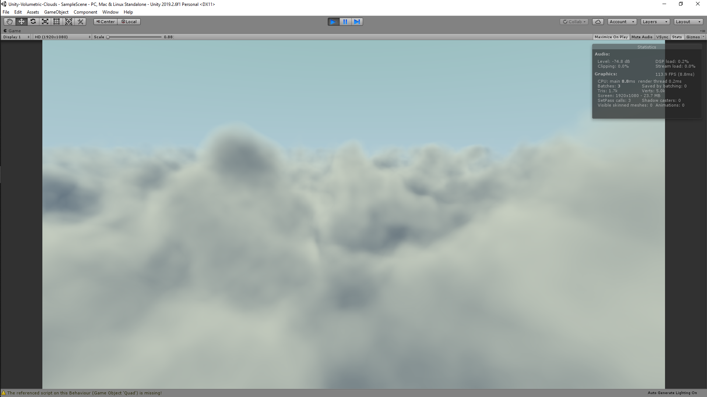

# Unity-Volumetric-Clouds
I attempted to implement potentially the most iconic [clouds shader](https://www.shadertoy.com/view/XslGRr) by iq in a way that works in Unity. I didn't realise that the noise texture for his shader was an unusual one. To create the same texture in Unity, I created a custom function that generates it in run-time. The algorithm was found in this interesting thread [here](https://www.shadertoy.com/view/4sfGzS).

## Next
I would like to integrate this shader with the scene's camera, which allows the user to look around the clouds from many angles...
